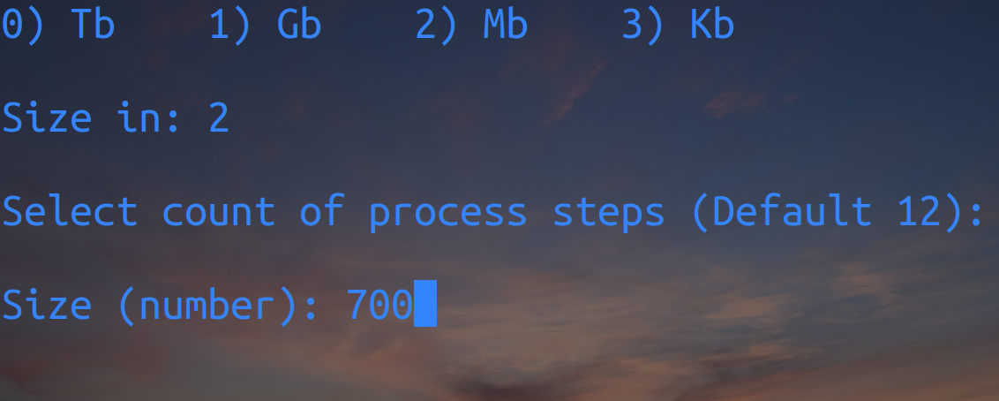

# Test-Files-Creator
A script that creates files of the specified size.

## Installation

#### On Windows

* Download Windows version archive and unzip it in any directory
* Start exe file

#### On Linux

* Clone repozitory: `git clone https://github.com/1IxI1/Test-Files-Creator/ && cd Test-Files-Creator`
* Install needest modules: `pip install -r requements.txt`
* Start the script: `python3 main.py`

## Usage

After run the script you must select type of size and size of file

After script working file of selected size will be in script folder and named file.txt

## Notes

Step size 12 is optimal for an average amount of RAM (4-8GB) and creating files up to 96 GB. Choose the step size based on these parameters. The smaller the RAM and the larger the file being created, the larger the step size should be. 

#### How do I calculate the step size if script show 'Killed'? 

`The size of the file you are going to create (in GB)`/`the Amount of your RAM`=`the Minimum step size for this operation`

### Warning
The larger the step size, the greater the error in file size
